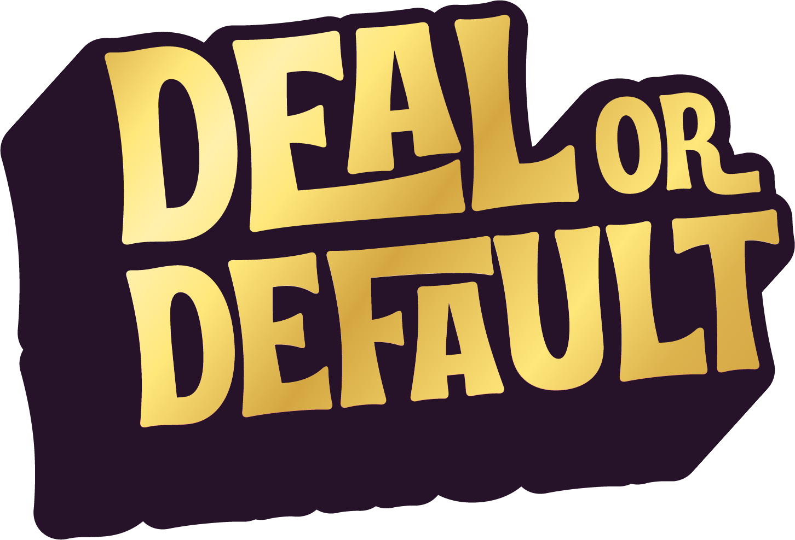

  

# 💼 Deal or Default 🎲

A turn-based multiplayer board game simulating financial diplomacy, FDI investments, tariff wars, and economic events.

## 🎮 Features
- 2–6 player multiplayer
- Special tiles: ladders, snakes, tariffs, sanctions, events
- Investment and debt mechanics
- Local and global micro events
- Liquidity crunch, hedging, and waivers

## 📜 Game Manual
[📘 Click here to view the full Game Manual (PDF)](manual.pdf)

## 🛠️ Tech Stack
- Phaser.js (game engine)
- JavaScript (ES6)
- Hosted on GitHub Pages

## 🚀 Play Now
👉 [https://azmainmahdi.github.io/Deal-or-Default/](https://azmainmahdi.github.io/Deal-or-Default/)