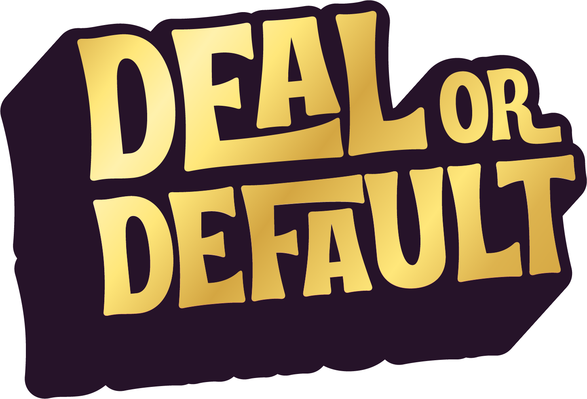

<p align="center"></p>

# Deal or Default

A turn-based board game about foreign investment, tariff wars and debt, for 2–6 players on a
100-square snakes-and-ladders board. This branch (`v2`) is a full rebuild: TypeScript, React,
a pure rules engine shared by local and online play.

- **Manual:** attached to the [legacy-v1 release](https://github.com/azmainmahdi/Deal-or-Default/releases/tag/legacy-v1).
- **Old Phaser build:** tag `legacy-v1`; still served from `main` on GitHub Pages.

```bash
npm install
npm run dev     # local dev server
npm test        # rules tests
npm run build   # static build in dist/ (works on Vercel and itch.io)
```
